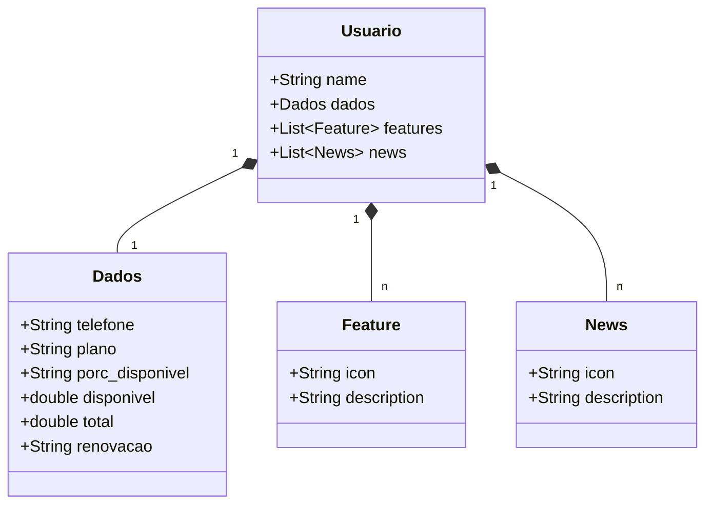

#Claro Java Dev + DIO 2024

## Diagrama de Classes

```mermaid
classDiagram
    class Usuario {
        +String name
        +Dados dados
        +List~Feature~ features
        +List~News~ news
    }

    class Dados {
        +String telefone
        +String plano
        +String porc_disponivel
        +double disponivel
        +double total
        +String renovacao
    }

    class Feature {
        +String icon
        +String description
    }

    class News {
        +String icon
        +String description
    }

    Usuario "1" *-- "1" Dados
    Usuario "1" *-- "n" Feature
    Usuario "1" *-- "n" News
```
